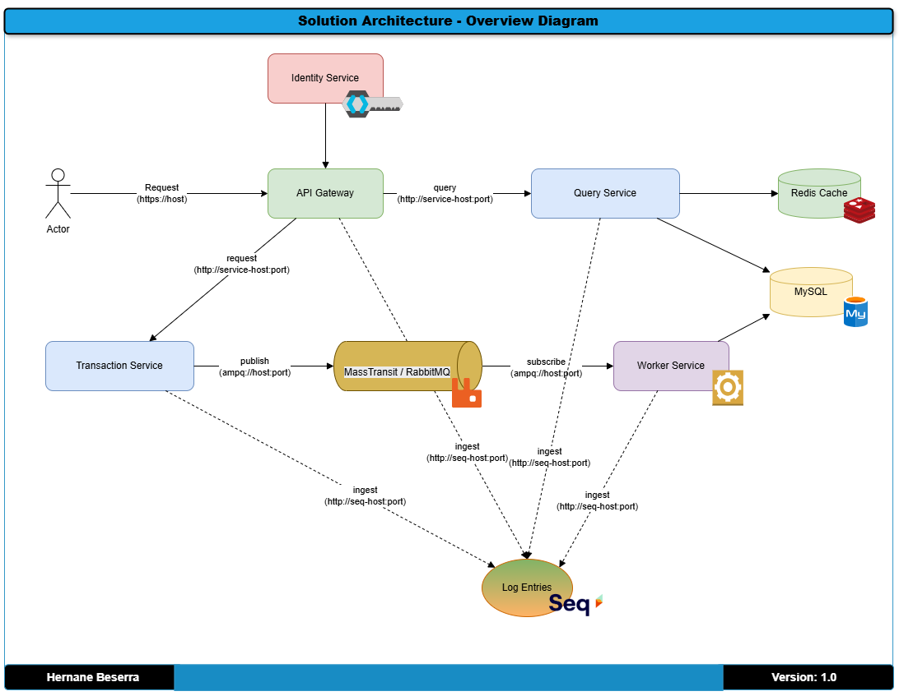

# Proveniência dos dados
title: "Arquitetura da solução: Diagrama Visão Geral dos componentes" \
author: Hernane Beserra \
date: "2025-04-10"

## Objetivo: 
Mostrar os principais blocos da solução e como eles se relacionam.

### Diagramas
O diagrama abaixo mostra a separação de responsabilidades, uso de padrões (ex: CQRS, Clean Architecture), modularidade e pontos de escalabilidade.

**Incluí:**
- API Gateway
- Services (ex: IdentityService, QueryService, TransactionService)
- Banco de dados
- Mensageria (ex: RabbitMQ)
- Cache (ex: Redis)
- Integrações externas
- 

[Voltar](../../ADRs/docs/decisions/0000-solution-overview-(high-level-architecture).md)