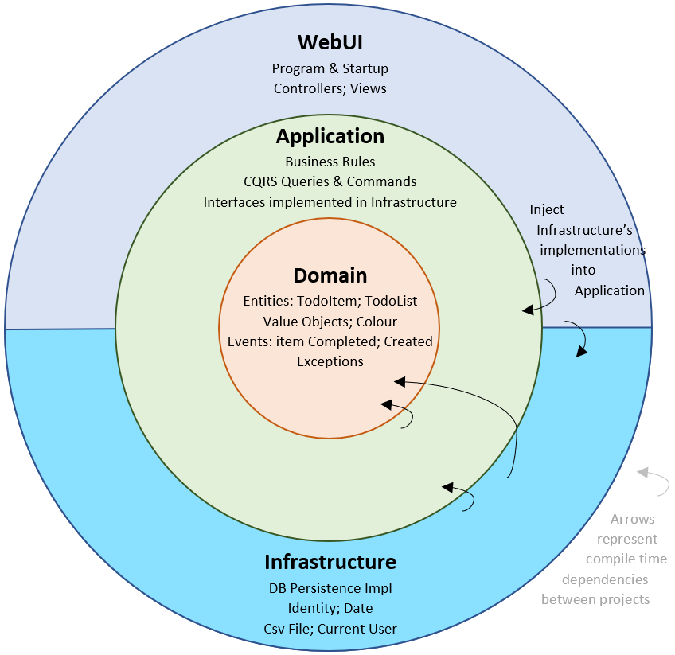
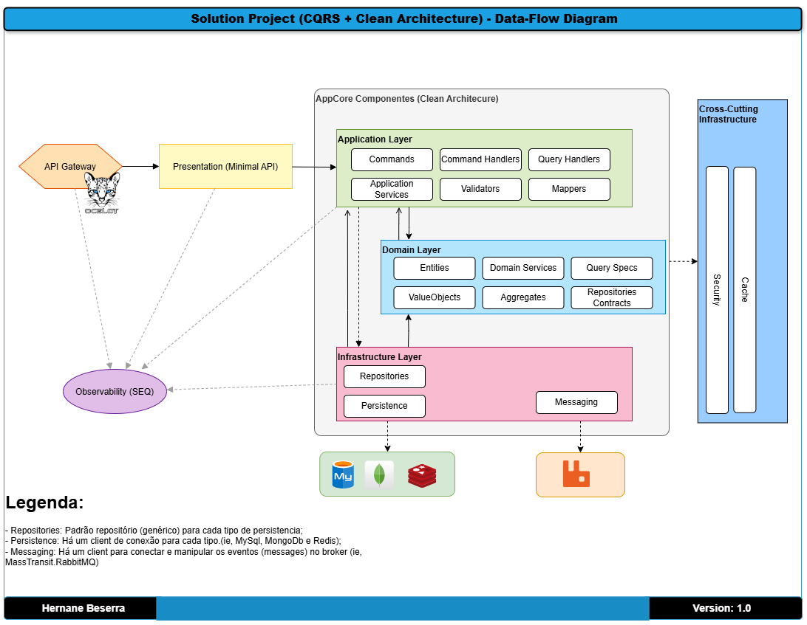

# Proveniência dos dados
title: "Solução do Projeto: Diagrama Visão Geral dos componentes" \
author: Hernane Beserra \
date: "2025-04-10"

## Objetivo: 
Mostrar os principais blocos da solução de projeto (.NET) e como eles se relacionam.

### Diagramas
O diagrama abaixo mostra a separação de responsabilidades com o uso do padrão Clean Architecture.

#### Visão geral do padrão de arquitetura limpa

#### Visão da solução de projeto com CQRS + Clean Architecture

[Voltar](../../ADRs/docs/miscs/estrutura-pasta-do-projeto.md)