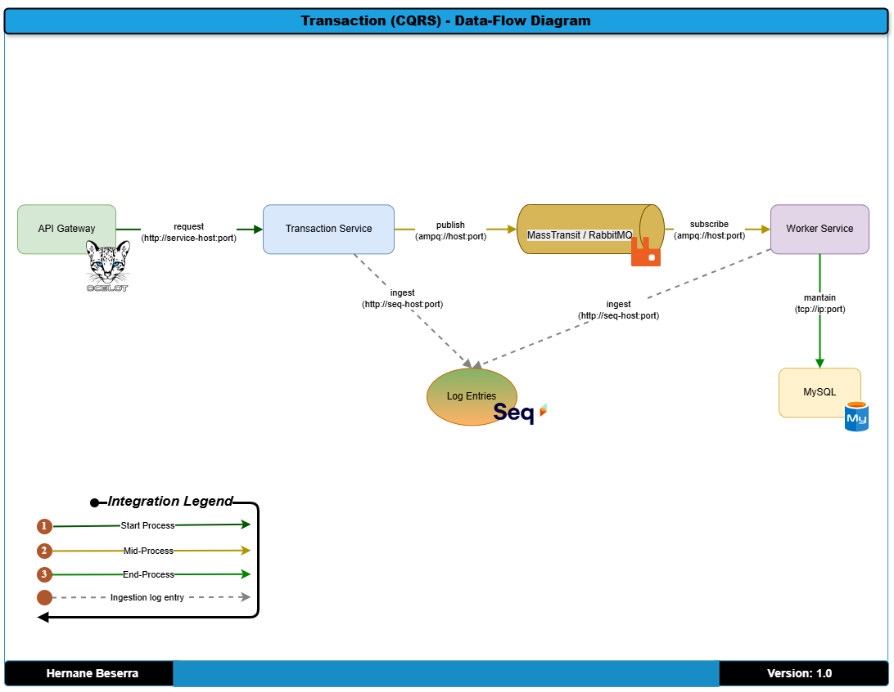
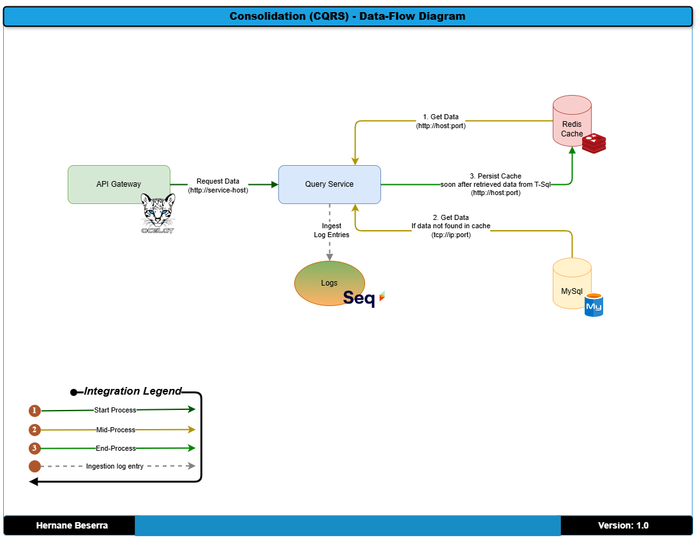

# Proveniência dos dados
title: "Fluxo do CQRS: Diagrama de Fluxo" \
author: Hernane Beserra \
date: "2025-04-10"

## Objetivo: 
Demonstrar o fluxo de dados da aplicação, especialmente em abordagens como CQRS, Event Sourcing ou Persistência.

## Alvo: 
Deixa claro como a aplicação lida com consistência, eventos, e separação de escrita/leitura.

### Diagramas
Os diagramas abaixo mostra, a separação de responsabilidades de escrita e leitura usado no padrão CQRS.

### WriteModel

### ReadModel

[Voltar](../../ADRs/docs/decisions/0000-solution-overview-(high-level-architecture).md)