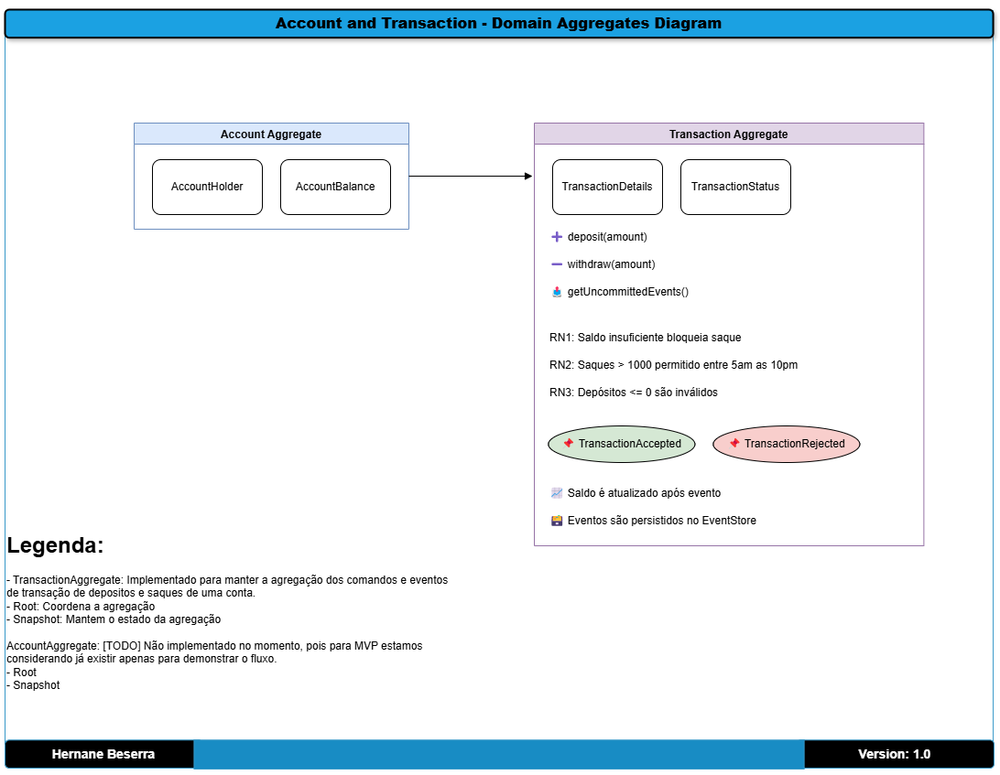

# Proveniência dos dados
title: "Conta e Transações: Diagrama de Domínio de Agregação" \
author: Hernane Beserra \
date: "2025-04-10"

## Objetivo:
Representar as entidades principais, suas agregações e comportamentos.

**Exemplos:**
BankAccount → Transactions

Regras de negócio embutidas no AggregateRoot

## Alvo: 
Ótimo para mostrar DDD, encapsulamento de regras de negócio e consistência.

[Voltar](../../ADRs/docs/decisions/0000-solution-overview-(high-level-architecture).md)