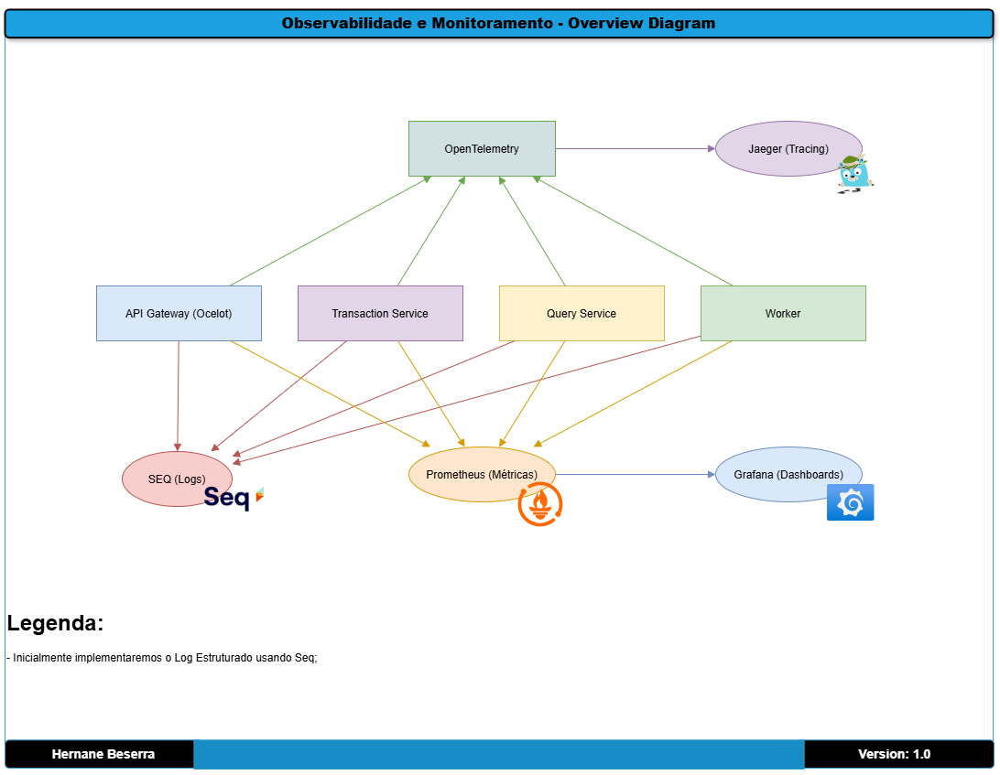

# Proveniência dos dados
title: "Conta e Transações: Diagrama de Domínio de Agregação" \
author: Hernane Beserra \
date: "2025-04-10"

## Objetivo:
Mostra como pretende-se monitorar e garantir resiliência da arquitetura de solução.

**Inclua:**
- Logs (eg, Serilog + Seq)
- Métricas (eg, Prometheus + Grafana)
- Rastreabilidade (eg, OpenTelemetry + Jaeger)
- Health Checks, Retry Policies, Circuit Breakers (eg, Polly)

## Alvo:
Resiliência nas operações e na arquitetura como um todo.

## Diagramas

[Voltar](../../ADRs/docs/decisions/0002-implementação-de-observabilidade-e-monitoramento-com-seq,-prometheus-e-opentelemetry.md)