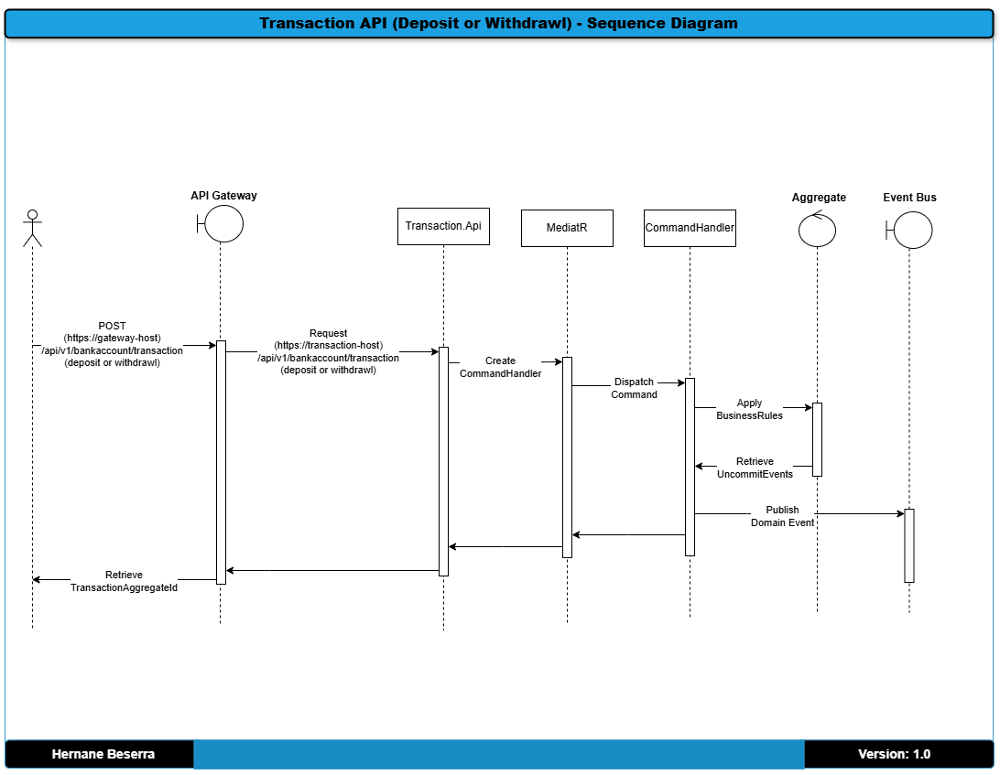
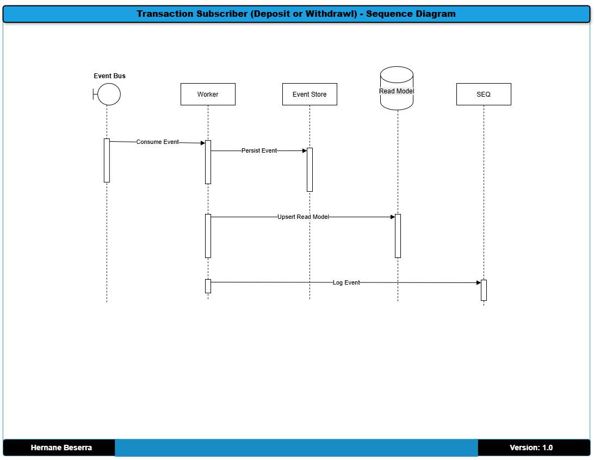
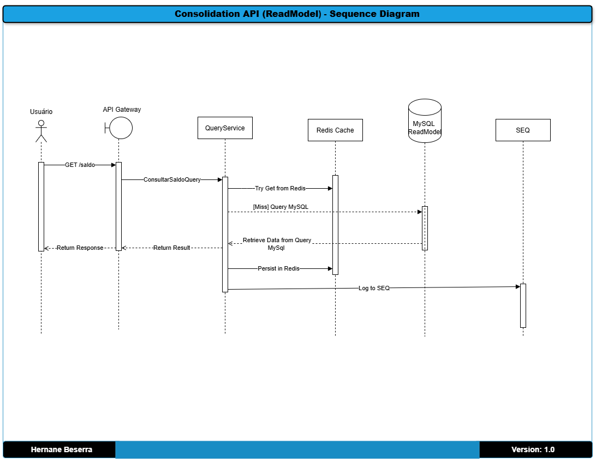

# Proveniência dos dados
title: "Fluxo de Transações: Diagrama de Sequencia" \
author: Hernane Beserra \
date: "2025-04-10"

## Objetivo:
Mostrar a sequência de chamadas entre os componentes para um determinado caso de uso (ex: “Criar uma transação bancária”).

## Target: 
Demonstra entendimento de sincronismo, timing, responsabilidades e acoplamento.

### Diagramas
O diagrama abaixo mostra a sequencia entre os componentes do projeto para executar uma transação bancaria (ie, deposito ou saque).

#### Fluxo de Sequencia da Transação API (eg, deposito ou saque)

#### Fluxo de Sequencia da Transação Subscriber (eg, deposito ou saque)

#### Fluxo de Sequencia da Consolidação API (eg, saldo e extratos)

[Voltar](../../ADRs/docs/decisions/0000-solution-overview-(high-level-architecture).md)